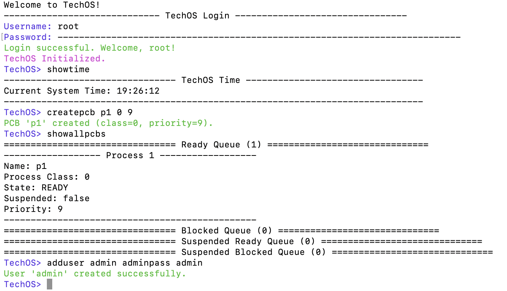

# TechOS



# Projection Information
- **Project Name:** TechOS
- **Course:** CS 450 - Operating System Structures
- **Institution:** West Virginia University Institute of Technology
- **Authors:** Beatriz Ristau & Tommi Kenneda
- **Programming Language:** C
- **Completion Date:** Dec 7, 2021

# Project Overview
TechOS is a lightweight operating system implementation developed as part of CS 450 (Operating
System Structures) at West Virginia University Institute of Technology. The project showcases
core operating system concepts such as process management, memory management, file systems, and
user interfaces. The project is divided into several modules, each focusing on a specific
aspect of operating system design.

# Module R1 - Command Line Interface Foundation
This module establishes the fundamental user interface framework for TechOS. This module 
implements the Command Handler (COMHAN) that serves as the primary interaction point 
between users and the operating system. The Command Handler processes user input, dispatch commands, 
and manages the command history. It is designed to be extensible, allowing for the addition of new commands and features in future
modules.

## Input Validation and Error Handling
In this module, an input validation and error handling mechanism is implemented to ensure that user inputs are correctly formatted and valid.
This includes checking for valid command syntax, ensuring that required parameters are provided, and handling errors gracefully
without crashing the system. The system provides feedback to users when invalid inputs are detected, guiding
them to correct usage.

### Command Recognition and Case Sensitivity
The system implements **case-sensitive** command recognition, which means that users must type commands exactly as specified.
When a user types a command, the Command Handler checks the input against a predefined list of valid commands.
If the command is recognized, it is executed; otherwise, an error message is displayed. This
ensures that users are aware of the correct command syntax and helps prevent accidental command execution.

### Whitespace Handling and Input Normalization
The Command Handler normalizes user input by removing leading and trailing whitespace. This allows users to enter
commands without worrying about extra spaces at the beginning or end of their input. The system also supports
commands with multiple spaces between words, treating them as a single space. This flexibility enhances user experience
by allowing more natural input without strict formatting requirements.

### Invalid Command Detection and Error Messages
When a user enters an invalid command, the Command Handler detects this and provides a clear error message.
The error message includes the command that was attempted and a suggestion to use the `help` command for assistance.
This helps users understand what went wrong and how to correct their input. 

### Argument Validation and Parameter Checking
The system checks for the presence of required parameters for commands that require them.
If the parameter is incorrect, the system provides an error message indicating the expected command syntax.
This validation ensures that commands are executed with the correct parameters, preventing errors during execution.

### Missing Argument Detection
For commands that require arguments, the system checks if the user has provided the necessary parameters.
If a required argument is missing, the system prompts the user with an error message indicating the expected
syntax. This helps users understand how to properly use the command and prevents confusion.

### Input Length and Buffer Management
The Command Handler limits the length of user input to prevent buffer overflow and ensure system stability. 
Max user input length is set to 100 characters. If a user attempts to enter a command that 
exceeds the maximum allowed length, the system provides an error message indicating that the input is too long. 
This prevents potential security vulnerabilities and ensures that the system remains responsive to user commands.

## Available Commands

### help
- **Purpose:** Provides documentation for all system commands, supporting both general 
overview and detailed command-specific information.
- **Syntax:** 
    `help`
    `help [command]`
- **Implementation Details:** 
    - Displays a list of all available commands when called without arguments.
    - When called with a specific command, it provides detailed information about that command.
    - Uses a simple text-based interface to present help information.
- **Usages Example:**
```
TechOS> help
------------------------------------------------------------------------------
TechOS Help Summary
------------------------------------------------------------------------------
General Commands:
    help [command]        - Display a summary of all commands or detailed help for a specific command.
    version               - Show current version, authors, and completion date.
    showdate              - Display the current system date.
    setdate MM-DD-YYYY    - Change the system date to the specified value.
    showtime              - Display the current system time.
    clear                 - Clear the terminal screen.
    exit, quit            - Terminate TechOS (with confirmation).

User Management Commands:
    adduser <user> <pass> <role> - Create a new user account.
    removeuser <user>     - Remove a user account.
    addadmin <user>       - Grant administrator privileges to a user.
    removeadmin <user>    - Revoke administrator privileges from a user.
    changepassword <user> - Change a user's password.

PCB Management Commands:
    createpcb <name> <class> <prio> - Create a new Process Control Block.
    deletepcb <name>      - Remove a PCB from the system.
    blockpcb <name>       - Move a PCB to the blocked queue.
    unblockpcb <name>     - Move a PCB to the ready queue.
    suspendpcb <name>     - Mark a PCB as suspended.
    resumepcb <name>      - Resume a suspended PCB.
    setpcbpriority <name> <prio> - Change the priority of a PCB.
    showpcb <name>        - Display detailed information for a specific PCB.
    showallpcbs           - List all PCBs in the system.
    showreadypcbs         - List all PCBs in the ready queue.
    showblockedpcbs       - List all PCBs in the blocked queue.

Filesystem Commands:
    ls [-l] [path]        - List directory contents.
    cd [path]             - Change the current directory.
    mkdir <folder>        - Create a new directory.
    rmdir <folder>        - Remove an empty directory.
    touch <file>          - Create a new, empty file.
    rm <file>             - Remove a file.

Scheduler Commands:
    loadpcb <name> <prio> <file> - Load processes from a file into a PCB.
    dispatchpcbs          - Simulate the process scheduler.

TechOS> help setdate
------------------------------------------------------------------------------
Setdate Command
------------------------------------------------------------------------------
    Syntax:
      setdate MM-DD-YYYY

    Description:
      Sets the system date to the specified value. Validates format and logical date (including leap years).

    Example:
      TechOS> setdate 12-25-2021
      TechOS date successfully changed to: 12-25-2021

    Possible Error Messages:
      Error: Missing date argument. Syntax: setdate MM-DD-YYYY
      Error: Invalid date format. Please use MM-DD-YYYY.
      Error: Invalid date value (e.g., day 31 is invalid for month 04 in year 2021).
```

### version
- **Purpose:** Displays the current version of TechOS, along with author information and the date of completion.
- **Syntax:**
    `version`
- **Implementation Details:**
    - Outputs the version number, author names, and completion date in a formatted manner.
- **Usages Example:**
```
TechOS> version
TechOS Version: 5.0
Authors: Beatriz Ristau & Tommi Kenneda
Completion Date: Dec 7, 2021
```

### showdate
- **Purpose:** Displays the current system date using system time functions and formatted output.
- **Syntax:**
    `showdate`
- **Implementation Details:**
    - Retrieves and displays the current date in a user-friendly format.
- **Usages Example:**
```
TechOS> showdate
Current TechOS Date: 07-06-2021
```

### setdate
- **Purpose:** Allows users to change the system date with validation to ensure correctness.
- **Syntax:**
    `setdate MM-DD-YYYY`
- **Implementation Details:**
    - Accepts a date in the format MM-DD-YYYY.
    - Validates the date to ensure it is within acceptable ranges (e.g., no February 30th).
    - If no date is provided, error message is displayed with the correct syntax.
    - If the date is valid, it updates the system date and confirms the change.
- **Usages Example:**
```
TechOS> setdate
Error: Missing date argument. Syntax: setdate MM-DD-YYYY

TechOS> setdate 02-30-2021
Error: Invalid date value (e.g., day 30 is invalid for month 2 in year 2021).

TechOS> setdate july 8 2021
Error: Invalid date format. Please use MM-DD-YYYY.

TechOS> setdate 7-21-2020
TechOS date successfully changed to: 07-21-2020
```

### showtime
- **Purpose:** Displays the current system time using system time functions and formatted output.
- **Syntax:**
    `showtime`
- **Implementation Details:**
    - Retrieves and displays the current time in a user-friendly format.
    - Displays in 24-hour format (HH:MM:SS).
- **Usages Example:**
```
TechOS> showtime
Current System Time: 12:42:03
```

### exit, quit
- **Purpose:** Terminates the TechOS session with a confirmation prompt.
- **Syntax:**
    `exit`
    `quit`
- **Implementation Details:**
    - Prompts the user for confirmation before exiting.
    - If confirmed, the session is terminated gracefully.
    - If the user chooses not to exit, the system returns to the command prompt.
- **Usages Example:**
```
TechOS> quit
Are you sure you want to exit TechOS? (yes/no): yes
Performing TechOS cleanup...
Shutting down TechOS. Goodbye!

TechOS> exit
Are you sure you want to exit TechOS? (yes/no): no
Termination cancelled.
TechOS> 
```

# Module R2 - Process Control Blocks (PCBs) Management

## Module Overview
This module introduces the Process Control Block (PCB) management system, which is a fundamental component of TechOS.
PCBs are data structures that store information about processes, including their state, priority, and other attributes. 
The module provides commands for creating, deleting, and managing PCBs, allowing users to interact with the process scheduler 
and control process execution.

## Process Control Block Architecture
The PCB architecture is designed to efficiently manage process information. Each PCB contains the following fields:
- **name:** The name of the process.
- **class:** The class of the process (0=system; 1=application).
- **priority:** The priority of the process (0-9).
- **state:** The current state of the process (ready, running, blocked).
- **suspended:** A flag indicating whether the process is suspended or not (true/false).
- **next:** A pointer to the next PCB in the linked list.
- **prev:** A pointer to the previous PCB in the linked list.
- **file_path:** The file path associated with the process, if applicable.
- **offset:** The offset in the file where the process starts (0 by default).

## Queue Management System
The PCB management system uses a queue-based architecture to manage processes. The system maintains four queues:

### 1. Ready Queue
The Ready Queue maintains all processes that are ready to executed and are waiting for CPU time. This queue implements
priority-based ordering, which means that processes with higher priority values are positioned in the front of the queue.
This ordering ensures that high-priority processes are executed first, while lower-priority processes wait for their turn.

### 2. Blocked Queue
The Blocked Queue operates on a fundamentally different principle, using a FIFO (First In, First Out) approach. 
This Design choice reflects the nature of blocked processes, which are typically waiting for resources or events to occur.
When a process is blocked, it is moved to the back of the Blocked Queue, and when it becomes unblocked, it is moved to 
the front of the Ready Queue.

### 3. Suspended Ready Queue
The Suspended Ready Queue is used to manage processes that are temporarily suspended.
When a process is suspended, it is moved to this queue, where it remains until it is resumed.
When a suspended process is resumed, it is moved back to the Ready Queue.

### 4. Suspended Blocked Queue
The Suspended Blocked Queue is similar to the Suspended Ready Queue, but it is used for processes that are blocked and suspended.
When a blocked process is suspended, it is moved to this queue, where it remains until it is resumed.
When a suspended blocked process is resumed, it is moved back to the Blocked Queue.

## Available Commands

### createpcb
- **Purpose:** Creates a new Process Control Block (PCB) with specified attributes.
- **Syntax:**
    `createpcb <name> <class> <prio>`
- **Implementation Details:**
    - Validates the input parameters (name, class, priority).
    - Creates a new PCB and adds it to the Ready Queue.
    - If the PCB already exists, an error message is displayed.
    - If the PCB is created successfully, a confirmation message is displayed.
    - If the PCB is not created successfully, an error message is displayed.
- **Usages Example:**
```
TechOS> createpcb p1 0 9
PCB 'p1' created (class=0, priority=9).

TechOS> createpcb p1 1 8
Error: Name already in use.

TechOS> createpcb p2 0
Error: Invalid arguments for 'createpcb'.
Usage: createpcb <name> <class> <priority>

TechOS> createpcb p2 6 8
Error: Class must be an integer 0 (system) or 1 (application).

TechOS> createpcb p2 0 10
Error: Priority must be an integer between 0 and 9.
```

### deletepcb
- **Purpose:** Deletes a specified PCB from the system.
- **Syntax:**
    `deletepcb <name>`
- **Implementation Details:**
    - Searches for the PCB with the specified name in the Queue.
    - If found, removes it from the queue and frees the associated memory.
    - If not found, displays an error message.
    - If the PCB is deleted successfully, a confirmation message is displayed.
    - If the PCB is not deleted successfully, an error message is displayed.
- **Usages Example:**
```
TechOS> deletepcb p1
PCB 'p1' deleted successfully.

TechOS> deletepcb p1
Error: PCB 'p1' not found.

TechOS> deletepcb p2 9
Error: Invalid arguments for 'deletepcb'.
Usage: deletepcb <name>

TechOS> deletepc p2
Error: Unknown command 'deletepc'. Type 'help' for available commands.
```

### blockpcb
- **Purpose:** Moves a specified PCB to the Blocked Queue.
- **Syntax:**
    `blockpcb <name>`
- **Implementation Details:**
    - Searches for the PCB with the specified name in the existing Queues.
    - If found, moves it to the Blocked Queue and updates its state.
    - If not found, displays an error message.
    - If the PCB is blocked successfully, a confirmation message is displayed.
    - If the PCB is not blocked successfully, an error message is displayed.
- **Usages Example:**
```
TechOS> blockpcb p2
PCB 'p2' blocked successfully.

TechOS> blockpcb p2
PCB 'p2' is already blocked.

TechOS> blockpcb p1
Error: PCB 'p1' not found.

TechOS> blockpc
Error: Unknown command 'blockpc'. Type 'help' for available commands.
```

### unblockpcb
- **Purpose:** Moves a specified PCB from the Blocked Queue to the appropriate Queue.
- **Syntax:**
    `unblockpcb <name>`
- **Implementation Details:**
    - Searches for the PCB with the specified name in the existing Queues.
    - If found, moves it to the Ready Queue and updates its state.
    - If not found, displays an error message.
    - If the PCB is unblocked successfully, a confirmation message is displayed.
    - If the PCB is not unblocked successfully, an error message is displayed.
- **Usages Example:**
```
TechOS> unblockpcb p2
PCB 'p2' unblocked successfully.

TechOS> unblockpcb p2
PCB 'p2' is not blocked.

TechOS> unblockpcb p1
Error: PCB 'p1' not found.

TechOS> ublockpcb p2
Error: Unknown command 'ublockpcb'. Type 'help' for available commands.
```

### suspendpcb
- **Purpose:** Suspends a specified PCB, moving it to the Suspended Ready Queue.
- **Syntax:**
    `suspendpcb <name>`
- **Implementation Details:**
    - Searches for the PCB with the specified name in the existing Queues.
    - If found, moves it to the Suspended Ready Queue and updates its state.
    - If not found, displays an error message.
    - If the PCB is suspended successfully, a confirmation message is displayed.
    - If the PCB is not suspended successfully, an error message is displayed.
- **Usages Example:**
```
TechOS> suspendpcb p2
PCB 'p2' suspended successfully.

TechOS> suspendpcb p2
PCB 'p2' is already suspended.

TechOS> suspendpcb p1
Error: PCB 'p1' not found.

TechOS> suspenpcb p1
Error: Unknown command 'suspenpcb'. Type 'help' for available commands.
```

### resumepcb
- **Purpose:** Resumes a suspended PCB, moving it back to the appropriate Queue.
- **Syntax:**
    `resumepcb <name>`
- **Implementation Details:**
    - Searches for the PCB with the specified name in the Suspended Ready Queue.
    - If found, moves it back to the Ready Queue and updates its state.
    - If not found, displays an error message.
    - If the PCB is resumed successfully, a confirmation message is displayed.
    - If the PCB is not resumed successfully, an error message is displayed.
- **Usages Example:**
```
TechOS> resumepcb p2
PCB 'p2' resumed successfully.

TechOS> resumepcb p2
PCB 'p2' is not suspended.

TechOS> resumepcb p1
Error: PCB 'p1' not found.

TechOS> resumpcb p2
Error: Unknown command 'resumpcb'. Type 'help' for available commands.
```

### setpcbpriority
- **Purpose:** Changes the priority of a specified PCB.
- **Syntax:**
    `setpcbpriority <name> <prio>`
- **Implementation Details:**
    - Searches for the PCB with the specified name in the existing Queues.
    - If found, updates its priority and reorders it in the Ready Queue based on the new priority.
    - If not found, displays an error message.
    - If the priority is set successfully, a confirmation message is displayed.
    - If the priority is not set successfully, an error message is displayed.
- **Usages Example:**
```
TechOS> setpcbpriority p2 5
PCB 'p2' priority set to 5 successfully.

TechOS> setpcbpriority p2 10
Error: Priority must be an integer between 0 and 9.

TechOS> setpcbpriority p1 3
Error: PCB 'p1' not found.

TechOS> setpbpriority p1 5
Error: Unknown command 'setpbpriority'. Type 'help' for available commands.
```

### showpcb
- **Purpose:** Displays detailed information about a specified PCB.
- **Syntax:**
    `showpcb <name>`
- **Implementation Details:**
    - Searches for the PCB with the specified name in the existing Queues.
    - If found, displays its attributes (name, class, priority, state, suspended status).
    - If not found, displays an error message.
- **Usages Example:**
```
TechOS> showpcb p2
------------------ Process p2 ------------------
Name: p2
Process Class: 1
State: READY
Suspended: true
Priority: 8
-----------------------------------------------

TechOS> showpcb p1
Error: PCB 'p1' not found.
```

### showreadypcbs
- **Purpose:** Lists all PCBs in the Ready Queue.
- **Syntax:**
    `showreadypcbs`
- **Implementation Details:**
    - Iterates through the Ready Queue and displays each PCB's name, class, priority, and state.
    - If the Ready Queue is empty, displays an empty queue.
    - If the Ready Queue is not empty, displays a list of all PCBs in the queue.
- **Usages Example:**
```
TechOS> showreadypcbs
================================ Ready Queue (1) ==============================
------------------ Process 1 ------------------
Name: p3
Process Class: 0
State: READY
Suspended: false
Priority: 5
-----------------------------------------------
================================ Ready Suspended Queue (1) ==============================
------------------ Process 1 ------------------
Name: p2
Process Class: 1
State: READY
Suspended: true
Priority: 8
-----------------------------------------------
```

### showblockedpcbs
- **Purpose:** Lists all PCBs in the Blocked Queue.
- **Syntax:**
    `showblockedpcbs`
- **Implementation Details:**
    - Iterates through the Blocked Queue and displays each PCB's name, class, priority, and state.
    - If the Blocked Queue is empty, displays an empty queue.
    - If the Blocked Queue is not empty, displays a list of all PCBs in the queue.
- **Usages Example:**
```
TechOS> showblockedpcbs
================================ Blocked Queue (1) ==============================
------------------ Process 1 ------------------
Name: p4
Process Class: 1
State: BLOCKED
Suspended: false
Priority: 2
-----------------------------------------------
================================ Blocked Suspended Queue (1) ==============================
------------------ Process 1 ------------------
Name: p5
Process Class: 0
State: BLOCKED
Suspended: true
Priority: 7
-----------------------------------------------
```

### showallpcbs
- **Purpose:** Lists all PCBs in the system, including those in the Ready Queue, Blocked Queue, Suspended Ready Queue, 
and Suspended Blocked Queue.
- **Syntax:**
    `showallpcbs`
- **Implementation Details:**
    - Iterates through all queues and displays each PCB's name, class, priority, and state.
    - If a queue is empty, it displays an empty queue message.
    - If there are PCBs in the queues, it displays a list of all PCBs in the system.
    - This command provides a comprehensive overview of all processes managed by the system.
- **Usages Example:**
```
TechOS> showallpcbs
================================ Ready Queue (1) ==============================
------------------ Process 1 ------------------
Name: p3
Process Class: 0
State: READY
Suspended: false
Priority: 5
-----------------------------------------------
================================ Blocked Queue (1) ==============================
------------------ Process 1 ------------------
Name: p4
Process Class: 1
State: BLOCKED
Suspended: false
Priority: 2
-----------------------------------------------
================================ Suspended Ready Queue (1) ==============================
------------------ Process 1 ------------------
Name: p2
Process Class: 1
State: READY
Suspended: true
Priority: 8
-----------------------------------------------
================================ Suspended Blocked Queue (1) ==============================
------------------ Process 1 ------------------
Name: p5
Process Class: 0
State: BLOCKED
Suspended: true
Priority: 7
-----------------------------------------------
```

# Module R3 - Process Scheduling and Dispatch

## Module Overview
This module implements the process scheduling and dispatch system for TechOS. It provides commands to load PCBs from files,
dispatch PCBs for execution, and simulate the process scheduler. The module is designed to work with the PCB management system
and provides a framework for managing process execution in TechOS.

## Process Scheduler Architecture
The process scheduler is responsible for managing the execution of processes in TechOS. It uses a round-robin scheduling algorithm
to ensure fair allocation of CPU time among processes. The scheduler operates on the Ready Queue, selecting the next process to 
execute based on its priority and state.

## Available Commands

### loadpcb
- **Purpose:** Loads a PCB from a file and adds it to the Ready Queue.
- **Syntax:**
    `loadpcb <name> <prio> <file>`
- **Implementation Details:**
    - Reads the specified file to load the PCB attributes (name, priority, file).
    - Validates the input parameters.
    - Creates a new PCB and adds it to the Ready Queue.
    - If the PCB already exists, an error message is displayed.
    - If the PCB is loaded successfully, a confirmation message is displayed.
    - If the PCB is not loaded successfully, an error message is displayed.
- **Usages Example:**
```
TechOS> loadpcb p1 5 PROC1
PCB 'p1' loaded successfully from file 'PROC1'.

TechOS> loadpcb p1 5 PROC1
Error: PCB 'p1' already exists.

TechOS> loadpcb p2 10 PROC2
Error: Priority must be an integer between 0 and 9.
```

### dispatchpcbs
- **Purpose:** Simulates the process scheduler by dispatching PCBs from the Ready Queue.
- **Syntax:**
    `dispatchpcbs`
- **Implementation Details:**
    - Iterates through the Ready Queue and selects the next PCB to execute based on its priority.
    - If the Ready Queue is empty, displays an error message.
    - If a PCB is dispatched successfully, it updates its state and displays a confirmation message.
    - If a PCB is not dispatched successfully, an error message is displayed.
- **Usages Example:**
```
TechOS> dispatchpcbs
Dispatcher: Running 'P1' (offset: 0)...
Dispatcher: Process 'P1' interrupted. New offset: 3.
Dispatcher: Running 'P2' (offset: 0)...
Dispatcher: Process 'P2' interrupted. New offset: 61.
Dispatcher: Probabilistically unblocking 'P1'.
Dispatcher: Running 'P1' (offset: 3)...
Dispatcher: Process 'P1' interrupted. New offset: 11.
Dispatcher: Probabilistically unblocking 'P2'.
Dispatcher: Running 'P2' (offset: 61)...
Dispatcher: Process 'P2' interrupted. New offset: 98.
Dispatcher: Probabilistically unblocking 'P1'.
Dispatcher: Running 'P1' (offset: 11)...
Dispatcher: Process 'P1' completed successfully.
Dispatcher: Probabilistically unblocking 'P2'.
Dispatcher: Running 'P2' (offset: 98)...
Dispatcher: Process 'P2' interrupted. New offset: 145.
Dispatcher: Running 'P3' (offset: 0)...
Dispatcher: Process 'P3' interrupted. New offset: 12.
Dispatcher: Running 'P4' (offset: 0)...
Dispatcher: Process 'P4' interrupted. New offset: 61.
Dispatcher: Running 'P5' (offset: 0)...
Dispatcher: Process 'P5' interrupted. New offset: 18.
Dispatcher: Stall prevention, unblocking 'P2'.
Dispatcher: Running 'P2' (offset: 145)...
Dispatcher: Process 'P2' interrupted. New offset: 191.
Dispatcher: Stall prevention, unblocking 'P3'.
Dispatcher: Probabilistically unblocking 'P4'.
Dispatcher: Running 'P3' (offset: 12)...
Dispatcher: Process 'P3' interrupted. New offset: 13.
Dispatcher: Running 'P4' (offset: 61)...
Dispatcher: Process 'P4' interrupted. New offset: 98.
Dispatcher: Stall prevention, unblocking 'P5'.
Dispatcher: Probabilistically unblocking 'P2'.
Dispatcher: Running 'P2' (offset: 191)...
Dispatcher: Process 'P2' completed successfully.
Dispatcher: Probabilistically unblocking 'P3'.
Dispatcher: Running 'P3' (offset: 13)...
Dispatcher: Process 'P3' interrupted. New offset: 24.
Dispatcher: Probabilistically unblocking 'P4'.
Dispatcher: Running 'P4' (offset: 98)...
Dispatcher: Process 'P4' interrupted. New offset: 145.
Dispatcher: Probabilistically unblocking 'P3'.
Dispatcher: Running 'P3' (offset: 24)...
Dispatcher: Process 'P3' interrupted. New offset: 25.
Dispatcher: Running 'P5' (offset: 18)...
Dispatcher: Process 'P5' interrupted. New offset: 61.
Dispatcher: Stall prevention, unblocking 'P4'.
Dispatcher: Probabilistically unblocking 'P3'.
Dispatcher: Running 'P3' (offset: 25)...
Dispatcher: Process 'P3' completed successfully.
Dispatcher: Probabilistically unblocking 'P5'.
Dispatcher: Running 'P4' (offset: 145)...
Dispatcher: Process 'P4' interrupted. New offset: 191.
Dispatcher: Running 'P5' (offset: 61)...
Dispatcher: Process 'P5' interrupted. New offset: 84.
Dispatcher: Stall prevention, unblocking 'P4'.
Dispatcher: Probabilistically unblocking 'P5'.
Dispatcher: Running 'P4' (offset: 191)...
Dispatcher: Process 'P4' completed successfully.
Dispatcher: Running 'P5' (offset: 84)...
Dispatcher: Process 'P5' completed successfully.
Dispatcher: All processes have finished execution.
```

# Module R4 - Filesystem Management

## Module Overview
This module implements the filesystem management system for TechOS. It provides commands for managing files and directories,
including creating, deleting, and listing files and directories. The module is designed to work with the Command Handler
and provides a framework for managing files in TechOS.

## Available Commands

### ls
- **Purpose:** Lists the contents of a directory.
- **Syntax:**
    `ls [-l] [path]`
- **Implementation Details:**
    - If the `-l` option is provided, it displays detailed information about each file (size, permissions, etc.).
    - If no path is specified, it lists the contents of the current directory.
    - If a path is specified, it lists the contents of that directory.
    - If the directory does not exist, an error message is displayed.
- **Usages Example:**
```
ls                          # List current directory contents
ls /home/user/documents     # List contents of absolute path
ls ../parent_folder         # List contents of relative path
ls -l                       # List current directory with file sizes
ls -l /home/user/documents  # List specified directory with file sizes
```

### cd
- **Purpose:** Changes the current working directory.
- **Syntax:**
    `cd [path]`
- **Implementation Details:**
    - If no path is specified, it changes to the home directory.
    - If a path is specified, it changes to that directory.
    - If the directory does not exist, an error message is displayed.
- **Usages Example:**
```
cd /home/user/documents     # Change to absolute path
cd "folder with spaces"     # Change to folder with spaces in name
cd documents                # Change to relative path
cd ..                       # Move up one directory level
cd .                        # Stay in the current directory
cd                          # Change to home directory
```

### mkdir
- **Purpose:** Creates a new directory.
- **Syntax:**
    `mkdir <folder>`
- **Implementation Details:**
    - Validates the folder name (no special characters, not empty).
    - Creates the directory in the current working directory.
    - If the directory already exists, an error message is displayed.
    - If the directory is created successfully, a confirmation message is displayed.
- **Usages Example:**
```
mkdir documents             # Create folder named "documents"
mkdir "My Documents"        # Create folder with spaces in name
mkdir project_files         # Create folder with underscores
```

### rmdir
- **Purpose:** Removes an empty directory.
- **Syntax:**
    `rmdir <folder>`
- **Implementation Details:**
    - Validates the folder name (no special characters, not empty).
    - Checks if the directory is empty before removing it.
    - If the directory does not exist, an error message is displayed.
    - If the directory is removed successfully, a confirmation message is displayed.
- **Usages Example:**
```
rmdir documents             # Remove folder named "documents"
rmdir "My Documents"        # Remove folder with spaces in name
```

### touch
- **Purpose:** Creates a new, empty file.
- **Syntax:**
    `touch <file>`
- **Implementation Details:**
    - Validates the file name (no special characters, not empty).
    - Creates an empty file in the current working directory.
    - If the file already exists, it updates the timestamp.
    - If the file is created successfully, a confirmation message is displayed.
- **Usages Example:**
```
touch readme.txt            # Create file named "readme.txt"
touch "My Document.docx"    # Create file with spaces in name
touch config.json           # Create configuration file
```

### rm
- **Purpose:** Removes a file.
- **Syntax:**
    `rm <file>`
- **Implementation Details:**
    - Validates the file name (no special characters, not empty).
    - Checks if the file exists before removing it.
    - If the file does not exist, an error message is displayed.
    - If the file is removed successfully, a confirmation message is displayed.
- **Usages Example:**
```
rm readme.txt               # Remove file named "readme.txt"
rm "My Document.docx"       # Remove file with spaces in name
rm old_config.json          # Remove configuration file
```

# Module R5 - User Account Management

## Module Overview
This module implements the user account management system for TechOS. It provides commands for creating, deleting, 
and managing user accounts, including adding and removing administrator privileges. The module is designed to work 
with the Command Handler and provides a framework for managing user accounts in TechOS.

## Available Commands

### adduser
- **Purpose:** Creates a new user account with specified attributes.


gcc src/execute.c -o execute
